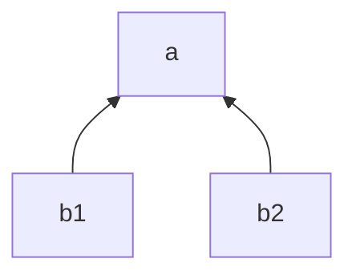
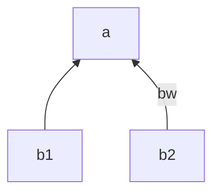

# Simple diagram

If your markdown editor does not display mermaid you can edit it here:
https://mermaid.live

For Pycharm there is a mermaid plugin



will be turned into the json string:

```json
{
  "name": "a",
  "aggregator": null,
  "config": null,
  "children": [
    {
      "name": "b1",
      "adapter": null,
      "config": null
    },
    {
      "name": "b2",
      "adapter": null,
      "config": null
    }
  ]
}
```

If we wanted to add adapters/aggregators to the nodes, we can use mermaids ':::' followed by the string
for the adapter/aggregator name. Note that these names are not visible in the diagram when it is rendered.


Alternatively, for all nodes (but the root node) we can use arrow description, 
to indicate the adapter/aggragaor of the
lower node.


Both graph descriptions will turn to:

```json
{
  "name": "a",
  "aggregator": "sum",
  "config": null,
  "children": [
    {
      "name": "b1",
      "adapter": null,
      "config": null
    },
    {
      "name": "b2",
      "adapter": "bw",
      "config": null
    }
  ]
}
```

It also pssible to have rows just for node definitions:


which will result to

```json
{
  "name": "a",
  "aggregator": "sum",
  "config": null,
  "children": [
    {
      "name": "b1",
      "adapter": "bw",
      "config": null
    },
    {
      "name": "b2",
      "adapter": "bw",
      "config": null
    }
  ]
}
```

We can also add configuration values to the nodes. Adding a `,` after the adapter/aggragor name
we can add any <key>:<value> pair, which will be added into the config.


```json
{
  "name": "a",
  "aggregator": "sum",
  "config": null,
  "children": [
    {
      "name": "b1",
      "adapter": "bw",
      "config": {
        "code": "xxx1"
      }
    },
    {
      "name": "b2",
      "adapter": "bw",
      "config": {
        "code": "xxx2"
      }
    }
  ]
}

```