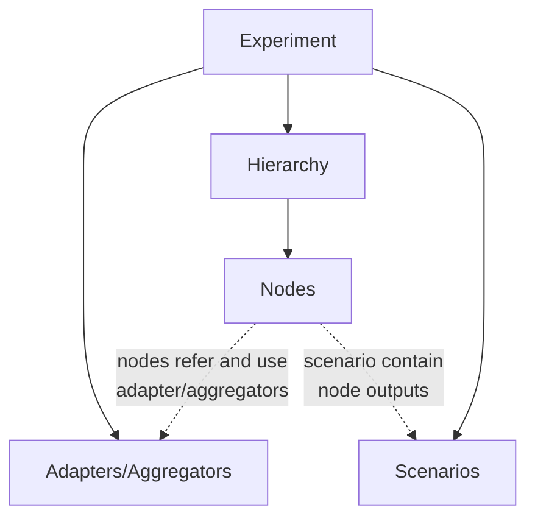
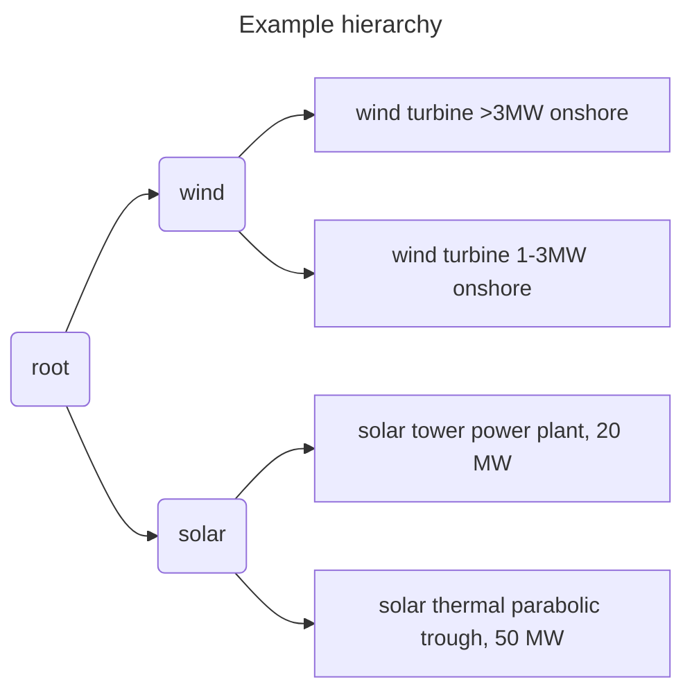

# Fundamentals

## Overview

- [Structure of an Enbios configuration](#structure-of-an-enbios-configuration)
- [A first example](#a-first-simple-example)
- [How to configure Adapters and Aggregators](#how-to-configure-adapters-and-aggregators)
- [Creating Adapters and Aggregators](#creating-adapters-and-aggregators)

This version is based on a very simple assumption. Calculating arbitrary (structural/terminal nodes) and aggregated
values (functional nodes) in
a MuSIASEM hierarchy for any type of scenarios (functional outputs).

The following diagram explains the main components and their interaction.
The main class is the Experiment. It requires a configuration object, which can come directly from a json file (or
a python dict object).

The behaviour of the MuSIASEM hierarchy elements (here called nodes) is not defined by fixed core implementation of
enbios, but through adapters and aggregators, which can dynamically be added.
We differentiate two types of nodes. Structural nodes (those at the bottom of the hierarchy) and functional nodes (all
nodes not on the bottom).
An experiment can specify any number of scenarios. Each scenario can specify different outputs for the nodes defined in
the hierarchy.

Structural nodes are each assigned an adapter, which calculates their result values based on their given output in a
scenario. Both outputs and resultvalues are passed up in the hierarchy until the root node (which is a functional node).

Functional nodes are each assigned an aggregator, which aggregates outputs and results and pass those up the hierarchy (
if there is a level up in the hierarchy for any given node).



In creation of an enbios experiment. its configuration, is on strictly validated.
Afterward any scenario or all scenarios, defined in the config object can be executed.

This version of enbios, is built with flexibility in mind. That means, the value calculation for structural nodes and
aggregation calculations for functional nodes is done in external python modules. Through this approach,
users can develop new arbitrary calculation (**Adapter**) and aggregation (**Aggregator**) modules and use them in
Enbios.

## Initializing an experiment

- check environment variables for link to experiment config file
- register additional units
- validate experiment data (structural validation)
- resolve experiment data links (eventual links to hierarchy and scenario files)
- validate full experiment data (structural validation)
- validate adapters
    - __For each defined adapter:__
        - load adapter module
        - <ada>adapter.validate_definition </ada>
        - <ada>adapter.validate_config </ada>
        - <ada>adapter.validate_methods </ada>
    - load builtin adapters
- validate aggregators
    - __For each defined aggregator:__
        - load aggregator module
        - <agg>aggregator.validate_config</agg>
    - load builtin aggregators
- validate hierarchy
    - basic structural validation
    - validate hierarchy nodes against their adapters, aggregators
      (<ada>adapter.validate_node</ada> <b>/</b> <agg>aggregator.validate_node</agg>)
- create template result-tree
- validate scenarios
    - create default scenario, if no scenario is defined
    - __for each defined scenario (or the default scenario)__:
        - validate scenario
            - __for each node that the scenario specifies:__
                - Validate the nodes scenario data against their adapter: <ada>adapter.validate_scenario_node</ada>)
        - prepare scenario result-tree
            - __for all structural nodes of the result-tree:__
                - Get the nodes output from its adapter: <ada>adapter.get_node_output</ada>
            - eventually remove exclude defaults (nodes with no output for a scenario) from the result-tree
            - from top to bottom aggregate the outputs within the result-tree (<agg>
              aggregator.aggregate_node_output</agg>)
- validate scenario settings: Check if the environmental settings, specify which scenarios to run

## Runnning an experiment

The function `Experiment.run` will run either

- all scenarios defined in the experiment config or
- run all scenarios specified in the config (a subset specifief in the experiment config or in through environmental
  variables )

Scenarios can also be run individually with: `Experiment.run_scenario`

### Running a scenario

For all adapters specified for the experiment:

- <ada>adapter.run_scenario</ada>
- add the results from the adapters to the result-tree

Propagate the results up in the result-tree:

From top to bottom aggregate the results within the result-tree (<agg>aggregator.aggregate_node_result</agg>)

## Adapters and aggregators

There are a some builtin adapters and aggregators:

**Adapters:**

- SimpleAssignmentAdapter: For this Adapter, the outputs and impacts can be defined in the adapter configuration
- BrightwayAdapter: This Adapter, uses brightway2 (https://docs.brightway.dev) in order to calculate impacts,
  based on the outputs of activities (structural nodes)

{{enbios.base.adapters_aggregators.adapter.EnbiosAdapter}}
**Aggregators**

- SumAggregator: This Aggregator simply sums up the impact results of its children in the hierarchy.

## Structure of an Enbios configuration

Enbios uses pydantic (https://docs.pydantic.dev/latest/), as data validation library
for the structural validation of the configuration file. The complete structural definitions of the data, is also given
as a JSON Schema (https://json-schema.org/)
file https://github.com/LIVENlab/enbios/blob/main/data/schema/experiment.schema.gen.json
Therefor the config data can also be validated with any JSON Schema validator (
e.g. https://www.jsonschemavalidator.net/)

The configuration data for an Enbios experiment has the following structure:

- adapters: a list of adapter configurations, that should be used in this experiment
- aggregators: a list of aggregator configurations, that should be used in this experiment
- hierarchy: a tree-like structure, where each node in the tree needs a name, depending on its position (structural or
  functional) an association with an adapter or aggregator, and some specific configuration for that (e.g. how to
  identify the node in the adapter/aggregator, default outputs)
- scenarios: a list of scenario configuration, containing in particular the outputs of the structural units
- config: Some generic configurations

## A first simple example

This example uses the brightway adapter and 4 activities of ecoinvent 3.9.1. The hierarchy contains 2 wind farms and 2
solar plants, which are in 2 functional nodes ('wind' and 'solar').
Additionally, the configuration contains 2 scenarios.



_(structural nodes are rectangles and functional nodes are rounded rectangles)_

Full details are below the configuration

```json
{
  "adapters": [
    {
      "adapter_name": "brightway-adapter",
      "config": {
        "bw_project": "ecoinvent_391"
      },
      "methods": {
        "GWP1000": [
          "ReCiPe 2016 v1.03, midpoint (H)",
          "climate change",
          "global warming potential (GWP1000)"
        ],
        "FETP": [
          "ReCiPe 2016 v1.03, midpoint (H)",
          "ecotoxicity: freshwater",
          "freshwater ecotoxicity potential (FETP)"
        ]
      }
    }
  ],
  "hierarchy": {
    "name": "root",
    "aggregator": "sum",
    "children": [
      {
        "name": "wind",
        "aggregator": "sum",
        "children": [
          {
            "name": "wind turbine >3MW onshore",
            "adapter": "bw",
            "config": {
              "code": "0d48975a3766c13e68cedeb6c24f6f74",
              "default_output": {
                "unit": "kilowatt_hour",
                "magnitude": 3
              }
            }
          },
          {
            "name": "wind turbine 1-3MW onshore",
            "adapter": "bw",
            "config": {
              "code": "ed3da88fc23311ee183e9ffd376de89b"
            }
          }
        ]
      },
      {
        "name": "solar",
        "aggregator": "sum",
        "children": [
          {
            "name": "solar tower power plant, 20 MW",
            "adapter": "bw",
            "config": {
              "code": "f2700b2ffcb6b32143a6f95d9cca1721"
            }
          },
          {
            "name": "solar thermal parabolic trough, 50 MW",
            "adapter": "bw",
            "config": {
              "code": "19040cdacdbf038e2f6ad59814f7a9ed"
            }
          }
        ]
      }
    ]
  },
  "scenarios": [
    {
      "name": "normal scenario",
      "activities": {
        "wind turbine >3MW onshore": [
          "kilowatt_hour",
          1
        ],
        "wind turbine 1-3MW onshore": [
          "kilowatt_hour",
          1
        ],
        "solar tower power plant, 20 MW": [
          "kilowatt_hour",
          1
        ],
        "solar thermal parabolic trough, 50 MW": [
          "kilowatt_hour",
          1
        ]
      }
    },
    {
      "name": "randomized outputs",
      "activities": {
        "wind turbine >3MW onshore": [
          "kilowatt_hour",
          6
        ],
        "wind turbine 1-3MW onshore": [
          "kilowatt_hour",
          1
        ],
        "solar tower power plant, 20 MW": [
          "kilowatt_hour",
          8
        ],
        "solar thermal parabolic trough, 50 MW": [
          "kilowatt_hour",
          6
        ]
      }
    }
  ]
}

```

### Configuration details

**adapters:** This list contains only the configuration for brightway-adapter. For each adapter, one of the given fields
must be given:

`module_path`: The absolute path of the module that contains the adapter.

`adapter_name`: The name of the builtin adapter.

Respectively for an aggregator (`module_path`, `aggregator_name`)

Besides the identification the adapter should have the fields `config` and `methods`.
For the `config` of the brightway-adapter it is crucial to include the field `bw_project`, so that enbios know which
brightway project to use.

For `methods` we need to pass a dictionary, where the keys are arbitrary names that we give to the method and the tuple
of strings, which are the names/identifiers of methods in brightway.

**aggregators**:

Since we only make use of the builtin _sum-aggregator_ which does not require any configuration, we can omit, this
field in the experiment configuration.

**hierarchy**:

Each node in the hierarchy has the following fields

_name_: An arbitrary name for that node (all names must be unique in the hierarchy)

_adapter_ | _aggregator_ : All structural nodes require an _adapter_ field and all functional nodes require an
_aggregator_ field. The values correspond to the name of the module, or it's specific node_indicator, which are 'sum'
for sum-aggregators and 'bw' for the brightway-adapter. (More details on that later)

_children_: A list of all the nodes children. This field is only required for functional nodes and must be omitted for
structural nodes.

_config_: A node specific config, that will be passed on to the Adapter ore Aggregator. The required fields depend on
the module at hand. In the case of brightway, we need some fields that help brightway to identify the activity.

**scenarios**:

A list of scenario configurations. Generally, we want to run multiple scenarios with different outputs for the
structural nodes.
Each configuration can have the following fields:

_name_: An arbitrary name for the scenario

_activities_: A dictionary where the keys are (structural) node names, as defined in the hierarchy and the values their
outputs. The outputs can have the form of a dictionary with the keys: `unit`, `magnitude` or list of 2 elements, where
the
first one defines the unit and the 2nd the amount. E.g. these two definitions are
equivalent: `{'unit':'kilowatt_hour','magnitude':5}` and `['kilowatt_hour', 5]`.

_config_: A dictionary with scenario specific configuration.

## How to configure Adapters and Aggregators

Before we look at how adapter and aggregator are created and work, we look at how users can look up how to specify them,
when making use of them.

There are 2 parts in the experiment file, where adapter/aggregator specific data has to be used. In the configuration of
the module (`adapters`/`aggregators`) in the experiment configuration and for each node, in the `config` field.

As seen in the example the adapter data for the _brightway-adapter_ looks like this:

```json
{
  "adapter_name": "brightway-adapter",
  "config": {
    "bw_project": "ecoinvent_391"
  },
  "methods": {
    "GWP1000": [
      "ReCiPe 2016 v1.03, midpoint (H)",
      "climate change",
      "global warming potential (GWP1000)"
    ],
    "FETP": [
      "ReCiPe 2016 v1.03, midpoint (H)",
      "ecotoxicity: freshwater",
      "freshwater ecotoxicity potential (FETP)"
    ]
  }
}
```

And the structural nodes in the example, have a config specific for the _brightway_adapter_

```json
{
  "name": "electricity production, wind, >3MW turbine, onshore",
  "adapter": "bw",
  "config": {
    "code": "0d48975a3766c13e68cedeb6c24f6f74",
    "default_output": {
      "unit": "kilowatt_hour",
      "magnitude": 3
    }
  }
}
```

All adapters/aggregators have the static function `get_config_schemas`, which gives us the corresponding json-schemas
for
configuration. Adapters return 3 schemas which are (by convention) called: `adapter`, `activity` and `method`, while
aggregators contain the schemas `aggregator`, `activity`.

Since the method `get_config_schemas` is static, we can call it directly on the class and do not need to initiate any
object before. So we can call
`BrightwayAdapter.get_config_schemas()` to get its config schemas.

However, there are some functions in Experiment for convenience of getting all configurations.
`get_builtin_adapters(details: bool = True)`
`get_builtin_aggregators(details: bool = True)`

will return dictionaries, which include `node_indicator` (the indicator to use for nodes) and (if the
parameter `details` is True (default:True)),
`config`, which will have the 2 (or the 3 in the case of aggregators) fields.

E.g. get_builtin_adapters

```json
{
  "assignment-adapter": {
    "activity_indicator": "assign",
    "config": {
      "activity": {
        "$defs": {
          "ActivityOutput": {
            "properties": {
              "unit": {
                "title": "Unit",
                "type": "string"
              },
              "magnitude": {
                "default": 1.0,
                "title": "Magnitude",
                "type": "number"
              }
            },
            "required": [
              "unit"
            ],
            "title": "ActivityOutput",
            "type": "object"
          },
          "ResultValue": {
            "additionalProperties": false,
            "properties": {
              "unit": {
                "title": "Unit",
                "type": "string"
              },
              "amount": {
                "anyOf": [
                  {
                    "type": "number"
                  },
                  {
                    "type": "null"
                  }
                ],
                "default": null,
                "title": "Amount"
              },
              "multi_amount": {
                "anyOf": [
                  {
                    "items": {
                      "type": "number"
                    },
                    "type": "array"
                  },
                  {
                    "type": "null"
                  }
                ],
                "title": "Multi Amount"
              }
            },
            "required": [
              "unit"
            ],
            "title": "ResultValue",
            "type": "object"
          }
        },
        "properties": {
          "activity": {
            "title": "Activity",
            "type": "string"
          },
          "output_unit": {
            "title": "Output Unit",
            "type": "string"
          },
          "default_output": {
            "$ref": "#/$defs/ActivityOutput"
          },
          "default_impacts": {
            "anyOf": [
              {
                "additionalProperties": {
                  "$ref": "#/$defs/ResultValue"
                },
                "type": "object"
              },
              {
                "type": "null"
              }
            ],
            "default": null,
            "title": "Default Impacts"
          },
          "scenario_outputs": {
            "anyOf": [
              {
                "additionalProperties": {
                  "$ref": "#/$defs/ActivityOutput"
                },
                "type": "object"
              },
              {
                "type": "null"
              }
            ],
            "default": null,
            "title": "Scenario Outputs"
          },
          "scenario_impacts": {
            "anyOf": [
              {
                "additionalProperties": {
                  "additionalProperties": {
                    "$ref": "#/$defs/ResultValue"
                  },
                  "type": "object"
                },
                "type": "object"
              },
              {
                "type": "null"
              }
            ],
            "default": null,
            "title": "Scenario Impacts"
          }
        },
        "required": [
          "activity",
          "output_unit",
          "default_output"
        ],
        "title": "SimpleAssignment",
        "type": "object"
      }
    }
  },
  "brightway-adapter": {
    "activity_indicator": "bw",
    "config": {
      "adapter": {
        "properties": {
          "bw_project": {
            "title": "Bw Project",
            "type": "string"
          },
          "use_k_bw_distributions": {
            "default": 1,
            "description": "Number of samples to use for MonteCarlo",
            "title": "Use K Bw Distributions",
            "type": "integer"
          },
          "store_raw_results": {
            "default": false,
            "description": "If the numpy matrix of brightway should be stored in the adapter. Will be stored in `raw_results[scenario.name]`",
            "title": "Store Raw Results",
            "type": "boolean"
          },
          "store_lca_object": {
            "default": false,
            "description": "If the LCA object should be stored. Will be stored in `lca_objects[scenario.name]`",
            "title": "Store Lca Object",
            "type": "boolean"
          }
        },
        "required": [
          "bw_project"
        ],
        "title": "BWAdapterConfig",
        "type": "object"
      },
      "activity": {
        "$defs": {
          "ActivityOutput": {
            "properties": {
              "unit": {
                "title": "Unit",
                "type": "string"
              },
              "magnitude": {
                "default": 1.0,
                "title": "Magnitude",
                "type": "number"
              }
            },
            "required": [
              "unit"
            ],
            "title": "ActivityOutput",
            "type": "object"
          }
        },
        "properties": {
          "name": {
            "default": null,
            "description": "Search:Name of the brightway activity",
            "title": "Name",
            "type": "string"
          },
          "database": {
            "default": null,
            "description": "Search:Name of the database to search first",
            "title": "Database",
            "type": "string"
          },
          "code": {
            "default": null,
            "description": "Search:Brightway activity code",
            "title": "Code",
            "type": "string"
          },
          "location": {
            "default": null,
            "description": "Search:Location filter",
            "title": "Location",
            "type": "string"
          },
          "unit": {
            "default": null,
            "description": "Search: unit filter of results",
            "title": "Unit",
            "type": "string"
          },
          "default_output": {
            "allOf": [
              {
                "$ref": "#/$defs/ActivityOutput"
              }
            ],
            "default": null,
            "description": "Default output of the activity for all scenarios"
          }
        },
        "title": "BrightwayActivityConfig",
        "type": "object"
      },
      "method": {
        "additionalProperties": {
          "items": {
            "type": "string"
          },
          "type": "array"
        },
        "description": "Simply a dict: name : BW method tuple",
        "title": "Method definition",
        "type": "object"
      }
    }
  }
}
```

On an experiment instance the following function can be
called: `get_all_configs(include_all_builtin_configs: bool = True)`, which
will return all configs for all adapters and aggregators specified in the experiment config data and all builtin
modules, when `include_all_builtin_configs` is set True (default).

The configs are in a dictionary in the fields `adapters`, `aggregators`

```json
  {
  "adapters": {
    "<adapter_name>": "<adapter_config>"
  },
  "aggregators": {
    "...": "..."
  }
}
```

## Creating Adapters and Aggregators

In order to create new adapters and aggregators, one has to create module which contain a class, which inherits
from the abstract classes `enbios.base.adapters_aggregators.adapter.EnbiosAdapter`
or `enbios.base.adapters_aggregators.aggregator.EnbiosAggregator` respectively.

The fact that these parent classes are abstract, means they both specify a set of
abstract methods, which any subclass needs to implement.

The internals of these functions is mostly up to the developer, but they have to make sure, that they return data of the
types that enbios requires (these return types are already included as return type hints in the abstract methods).

### Adapter

First, there are several validation functions. These functions serve to check the correctness of the input, but also to
store all configurations inside the adapter object as they are later needed for the execution. In case of invalid data,
they should raise an Exception. In the case some validation is not required, it is ok, they just contain `pass`.

`validate_definition(self, definition: AdapterModel)`

Validates the whole adapter definition, which is the whole dictionary (parse
as `enbios.models.models.AdapterModel`)

`validate_config(self, config: Optional[dict[str, Any]])`

Validates the configuration (the `config` value in the definition).

`validate_methods(self, methods: Optional[dict[str, Any]]) -> list[str]`

Validates the `methods` in the definition.

`validate_node(self, node_name: str, node_config: Any)`

Validates a node configuration, for each node that specifies this as its adapter.

`validate_node_output(self, node_name: str, target_output: ActivityOutput) -> float`

Validates the output of a node as part of a scenario validation in the experiment.

`get_node_output_unit(self, activity_name: str) -> str`

Get the output unit of a node.

`get_method_unit(self, method_name: str) -> str`

Get the unit of a method.

`get_default_output_value(self, activity_name: str) -> float`

Get the default output amount of a node (in its defined output unit).

`run_scenario(self, scenario: Scenario) -> dict[str, dict[str, ResultValue]]`

Run a scenario.

Additionally, there are some static method, which means, they can be called on the Adapter class.

`static node_indicator() -> str`

The indicator that can be used, to indicate that a node should use this adapter (alternatively, the name, as given in
name() can also be used).

`static get_config_schemas() -> dict[str, dict[str, Any]]`

Get the configuration schemas for `config`, `method` and  `activity`. The idea here, is that, these are generated from
Pydantic model classes, which are used `validate_config`, `validate_node` and `validate_methods`.

`static name() -> str`

Get the name of the adapter.

### Aggregator

`validate_config(self, config: Optional[dict[str, Any]])`

Validate the configuration of the aggregator.

`validate_node(self, node_name: str, node_config: Any)`

Validates a node configuration, for each node that specifies this as its aggregator.

`aggregate_node_output(self, node: BasicTreeNode[ScenarioResultNodeData], scenario_name: Optional[str] = "") -> Optional[NodeOutput]`

Aggregate the outputs of the children of a node. This method should return an optional NodeOutput, if the aggregation
was correct and there is some uniform output. This is in order to prevent errors higher up in the hierarchy. For
example, the Sum aggregator, returns NodeOutput, if the outputs (and crucially their units) can be summed up. It returns
None,
if the units don't fit together.
This function is already called during the initiation of an experiment as part of each scenario validation.

`aggregate_node_result(self, node: BasicTreeNode[ScenarioResultNodeData])`

Aggregate the results of the children of a node.

Static methods:

`def node_indicator() -> str`

The indicator that can be used, to indicate that a node should use this aggregator (alternatively, the name, as given in
name() can also be used).

`name() -> str`

Get the name of the adapter.

`get_config_schemas() -> dict`

<style>
    ada {
        color: darkgreen;
        font-weight: bold;
    }

    agg {
        color: darkorange;
        font-weight: bold;
    }

</style>